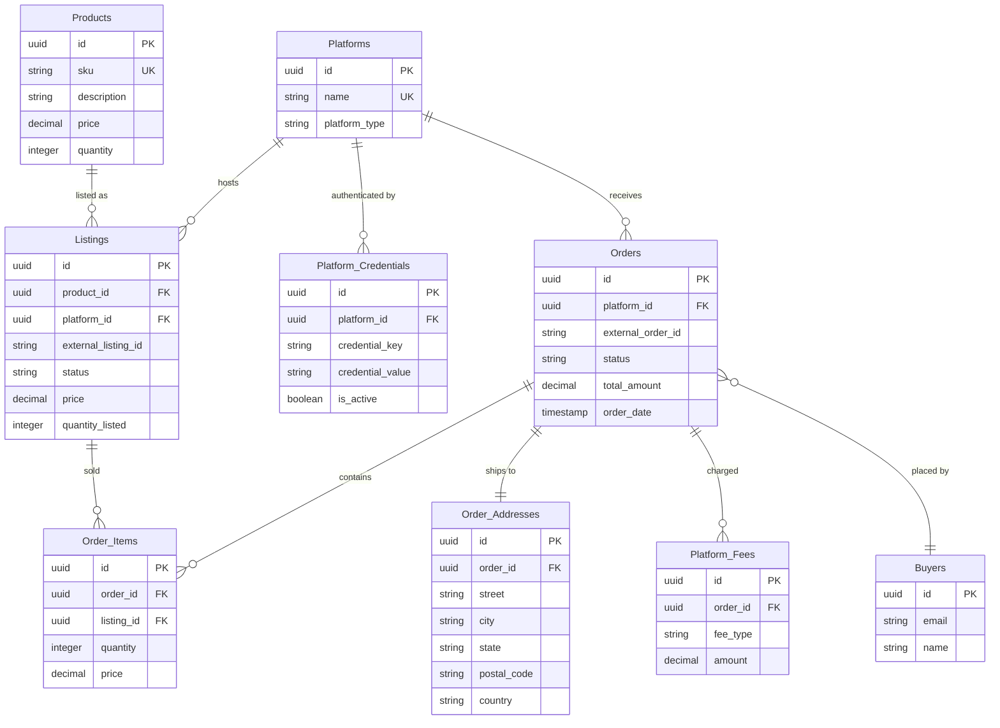

# Hopper Database Schema

This document provides a clean, human-friendly overview of the core entities, fields, and relationships in the Hopper data model.

## ER Diagram

Legend: `PK` primary key • `FK` foreign key • `UK` unique key

---

## Entities

### Products
Merchandise tracked and listed on various platforms.

| Column     | Type    | Constraints | Notes |
|------------|---------|-------------|-------|
| id         | uuid    | PK          | Generated UUID identifier |
| sku        | string  | UK          | Stock-keeping unit, unique per product |
| description| string  |             | Human-friendly description |
| price      | decimal |             | Unit price (e.g., currency) |
| quantity   | integer |             | On-hand or available quantity |

Relationships: one Product can have many Listings.

---

### Platforms
External marketplaces or channels where products are listed and orders originate.

| Column        | Type   | Constraints | Notes |
|---------------|--------|-------------|-------|
| id            | uuid   | PK          | |
| name          | string | UK          | Human-readable name (e.g., "eBay", "Etsy") |
| platform_type | string |             | Free-form or enum-like type label |

Relationships: one Platform has many Listings, Orders, and Platform_Credentials.

---

### Platform_Credentials
Secrets or configuration needed to connect to a Platform.

| Column          | Type    | Constraints | Notes |
|-----------------|---------|-------------|-------|
| id              | uuid    | PK          | |
| platform_id     | uuid    | FK          | References Platforms.id |
| credential_key  | string  |             | Key/name of the credential (e.g., "API_KEY") |
| credential_value| string  |             | Secret or value |
| is_active       | boolean |             | Toggle for rotation or deprecation |

Recommended: unique `(platform_id, credential_key)` to avoid duplicates.

---

### Listings
Per-platform representation of a Product (with its own price/status/quantity).

| Column             | Type    | Constraints | Notes |
|--------------------|---------|-------------|-------|
| id                 | uuid    | PK          | |
| product_id         | uuid    | FK          | References Products.id |
| platform_id        | uuid    | FK          | References Platforms.id |
| external_listing_id| string  |             | Identifier on the external platform |
| status             | string  |             | e.g., active, inactive, ended |
| price              | decimal |             | Listing-specific price |
| quantity_listed    | integer |             | Quantity exposed on the listing |

Recommended: unique `(platform_id, external_listing_id)`; indexes on `product_id`, `platform_id`.

---

### Orders
Orders received on a Platform.

| Column            | Type      | Constraints | Notes |
|-------------------|-----------|-------------|-------|
| id                | uuid      | PK          | |
| platform_id       | uuid      | FK          | References Platforms.id |
| external_order_id | string    |             | Identifier on the external platform |
| status            | string    |             | e.g., pending, paid, shipped, cancelled |
| total_amount      | decimal   |             | Order total amount |
| order_date        | timestamp |             | When the order was placed |

Recommended: unique `(platform_id, external_order_id)`.

---

### Order_Items
Line items within an Order, tied to a Listing.

| Column   | Type    | Constraints | Notes |
|----------|---------|-------------|-------|
| id       | uuid    | PK          | |
| order_id | uuid    | FK          | References Orders.id |
| listing_id| uuid   | FK          | References Listings.id |
| quantity | integer |             | Quantity purchased |
| price    | decimal |             | Unit price at time of sale |

---

### Buyers
Customer information associated with orders.

| Column | Type   | Constraints | Notes |
|--------|--------|-------------|-------|
| id     | uuid   | PK          | |
| email  | string |             | Email address |
| name   | string |             | Display/full name |

Relationship: a Buyer may place many Orders; an Order belongs to one Buyer (optionally, if provided by the platform).

---

### Order_Addresses
Shipping address for an Order (one-to-one).

| Column      | Type   | Constraints | Notes |
|-------------|--------|-------------|-------|
| id          | uuid   | PK          | |
| order_id    | uuid   | FK          | References Orders.id |
| street      | string |             | |
| city        | string |             | |
| state       | string |             | Region/state/province |
| postal_code | string |             | |
| country     | string |             | ISO code preferred |

---

### Platform_Fees
Fees charged by the Platform for an Order.

| Column  | Type    | Constraints | Notes |
|---------|---------|-------------|-------|
| id      | uuid    | PK          | |
| order_id| uuid    | FK          | References Orders.id |
| fee_type| string  |             | e.g., transaction, shipping, tax, commission |
| amount  | decimal |             | Amount for this fee line |

---

## Relationships Summary

- Products: one-to-many Listings
- Platforms: one-to-many Listings, Orders, Platform_Credentials
- Listings: many-to-one Products; many-to-one Platforms; one-to-many Order_Items
- Orders: one-to-many Order_Items; one-to-one Order_Addresses; one-to-many Platform_Fees; many-to-one Buyers (Buyer optional)
- Buyers: one-to-many Orders

## Conventions & Notes

- Types: `uuid`, `string`, `integer`, `decimal`, `timestamp`, `boolean` as shown in the ERD.
- Money fields: consider a consistent precision/scale (e.g., decimal(10,2)).
- Status fields: document expected values in application code or enums.
- Indexes: foreign keys and unique keys should be indexed for performance.
- Naming: snake_case table names and columns; pluralized table names per ERD.
